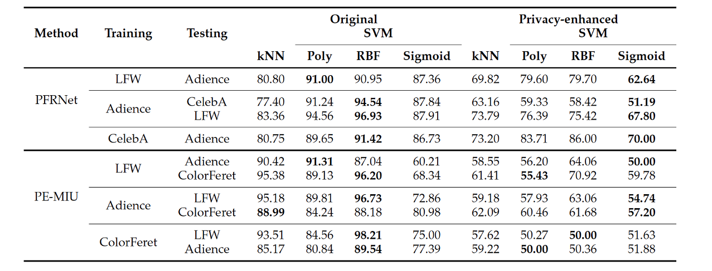
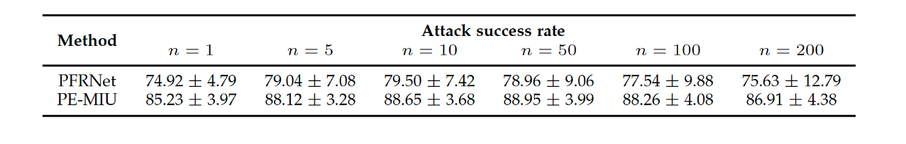

# Soft-biometric-Face-Privacy-Enhancement

Refactored code used in the paper "An attack on facial soft-biometric privacy enhancement" (TBIOM 2022, Osorio-Roig et al. (https://ieeexplore.ieee.org/abstract/document/9770950)). A summary of the paper can be found at the end of this README.


# Contribution

We introduce an attack on privacy-enhancing face recognition systems designed to conceal soft-biometric attributes at feature level. The insights perceived are based on two observations: 

- Highly similar facial representations usually originate from face images with similar soft-biometric attributes.

- To achieve high recognition accuracy, robustness against intra-class variations within facial
representations has to be retained in their privacy-enhanced versions.

The above observations are computed empirically and analysed from the data visualization.

### Installation

1- Download the databases [Adience](https://ieeexplore.ieee.org/document/6906255), [FERET](https://www.nist.gov/itl/products-and-services/color-feret-database), [LFW](https://vis-www.cs.umass.edu/lfw/), and [CelebA](https://mmlab.ie.cuhk.edu.hk/projects/CelebA.html) corresponding to the paper or those databases utilised on the attack. 

2- Balance the databases in terms of the soft-biometric attribute to be attacked, as shown on this plot:


3- Prepare unprotected face embeddings using the embedding extractors [VGGFace2](https://arxiv.org/abs/1710.08092) and [FaceNet](https://arxiv.org/abs/1503.03832). 

4- Prepare protected face embeddings using the soft-biometric privacy-enhancing technologies: [PE-MIU](https://ieeexplore.ieee.org/stamp/stamp.jsp?arnumber=9094207) and [code-github](https://github.com/pterhoer/PrivacyPreservingFaceRecognition/tree/master/training_free/pe_miu) and [PRFNet](https://ieeexplore.ieee.org/document/9320295)

5- ```pip install numpy```

6- ```pip install scipy```

6- Run script [Attacks](Attacks.py)

7- For [data-visualization] run [analysis-homogeinity](data-visualization/boxplot_homogeinity.py) and [T-SNE-analysis](data-visualization/tsne-yellowbrick.py)

8- For [gender-performance] run [gender-knn](gender-performance/gender_prediction_knn_crossdb.py) and [gender-svm](gender-performance/gender_prediction_svm_crossdb.py).

9- For [stat] run these [scripts](stat).


# Description of parameters

- '-tm', '--testmale', help='path to the male face privacy-enhanced templates'
- '-tf', '--testfemale', help='path to the female face privacy-enhanced templates'
- '-e', '--enrol', help= 'path corresponding to the templates to be enrolled or attacked'
- '-n', '--name', help='soft-biometric to attack, i.e. female or male'
- '-dbf', '--dbfirst', help= 'name of the database to evaluate at search (e.g. the attacker) for cross-database evaluation'
- '-dbs', '--dbsecond', help='name of the database to evaluate at enrolment (e.g. the attacked) for cross-database evaluation'
- '-o', '--output', help='path to the output, file csv with the statistics in terms of similarity scores'


# Suggestions

- Balance the databases in terms of the soft-biometric attribute to be attacked.
- Make sure you have the correct labels corresponding to the soft-biometric attribute from the attacker and attacked database, respectively.
- Prepare the databases according to the known labels.
- You receive with this code the best similarity scores resulting of the comparison between attacker database against attacked database. Similarity scores are optimised according to the used attack. Then, a chance of attack should be computed in terms of percentage for each known label or as average given the soft-biometric attribute to be attacked.


Project Organization
------------

    ├── LICENSE
    ├── README.md          <- The top-level README for developers using this project.
    ├── images             <- Figures for the README
    ├── Attacks            <- Execute the attacks on similarity scores
    ├── gender-performance <- Gender Prediction
    ├── data-visualization <- Execute Data Visualization
    ├── stat               <- Execute Descriptive Statistics


Paper: An Attack on Facial Soft-biometric Privacy Enhancement
------------

### Abstract

In the recent past, different researchers have proposed privacy-enhancing face recognition systems designed to conceal soft-biometric attributes at feature level. These works have reported impressive results, but generally did not consider specific attacks in their analysis of privacy protection. In this work, we introduce an attack on said schemes based on two observations: (1) highly similar facial representations usually originate from face images with similar soft-biometric attributes; (2) to achieve high recognition accuracy, robustness against intra-class variations within facial representations has to be retained in their privacy-enhanced versions. The presented attack only requires the privacy-enhancing algorithm as a black-box and a relatively small database of face images with annotated soft-biometric attributes. Firstly, an intercepted privacy-enhanced face representation is compared against the attacker's database. Subsequently, the unknown attribute is inferred from the attributes associated with the highest obtained similarity scores. In the experiments, the attack is applied against two state-of-the-art approaches. The attack is shown to circumvent the privacy enhancement to a considerable degree and is able to correctly classify gender with an accuracy of up to approximately 90%. Future works on privacy-enhancing face recognition are encouraged to include the proposed attack in evaluations on the privacy protection.

# Citation

If you use this code in your research, please cite the following paper:

```{bibtex}

@article{OsorioRoig-FaceSoftBiometricPrivacyAttack-TBIOM-2022,
 Author = {D. Osorio-Roig and C. Rathgeb and P Drozdowski and P. Terh{\"o}rst and V. {\v{S}}truc and C. Busch},
 File = {:https\://cased-dms.fbi.h-da.de/literature/OsorioRoig-FaceSoftBiometricPrivacyAttack-TBIOM-2022.pdf:URL},
 Groups = {TReSPAsS-ETN, ATHENE, NGBS},
 Journal = {Trans. on Biometrics, Behavior, and Identity Science ({TBIOM})},
 Keywords = {Soft Biometrics, Face Recognition, Data Privacy},
 Month = {April},
 Number = {2},
 Pages = {263--275},
 Title = {An Attack on Facial Soft-biometric Privacy Enhancement},
 Volume = {4},
 Year = {2022}
}
```

### Experiments

#### Data Visualization: Insights from different deep learning models


- Comparison trials for the same attribute (gender) yield slightly higher similarity scores and more outliers compared to those for different attributes on the unprotected domain using the models [VGGFace2](https://arxiv.org/abs/1710.08092) and [FaceNet](https://arxiv.org/abs/1503.03832). 

- Similar observation can be perceived on the protected domains [PE-MIU](https://ieeexplore.ieee.org/stamp/stamp.jsp?arnumber=9094207) and [PRFNet](https://ieeexplore.ieee.org/document/9320295).

- “Same attribute” boxplots are shifted towards higher similarity score.

- Facial image pairs which produce high similarity scores when comparing their corresponding privacy-enhanced templates have been visually inspected.


- Visualization of original (unproteced) and privacy-enhanced (protected) face representations over the [LFW]
database using t-distributed stochastic neighbour embeddings [t-SNE].

- This visualization shows that machine learning-based classifiers are not able to reliably predict gender from privacy-enhanced templates.

- It can be observed that in their original embeddings, faces are clustered with respect to gender, which is not the case for the privacy-enhanced templates.

#### Gender prediction performance of basic machine learning-based classifiers



- Gender prediction performance of basic machine learning-based classifiers on orginal (unprotected) and privacy-enhanced (protected) templates in cross-database scenarios (in %).

- A significant degradation of the gender prediction performance is observable for privacy-enhanced templates
compared to unprotected templates. 

- Lowest average gender prediction accuracy of 52.37% is obtained by [PE-MIU], in contrast to 65.22% for [PFRNet], over similar cross-database scenarios (i.e. training on [LFW] and [Adience] to predict on [Adience] and [LFW] respectively).

#### Vulnerability analysis



- Summarises the best average attack success rates across all cross-database scenarios for different values of n with a 95% confidence interval.

- [PE-MIU] and [PFRNet], are highly vulnerable to the proposed attack.


#### Ranked examples of samples that reach a high similarity score


- Ranked examples of samples that reach a high similarity score in a non-mated comparison of privacy-enhanced
templates of [PFRNet] (first and second row) and [PE-MIU] (third and fourth row); images taken from the [LFW] database.

- It can be seen that with high probability the gender of top-ranked samples is the same as that of the leftmost sample. 

- This suggests that the effect of broad homogeneity still exists in the protected domain.